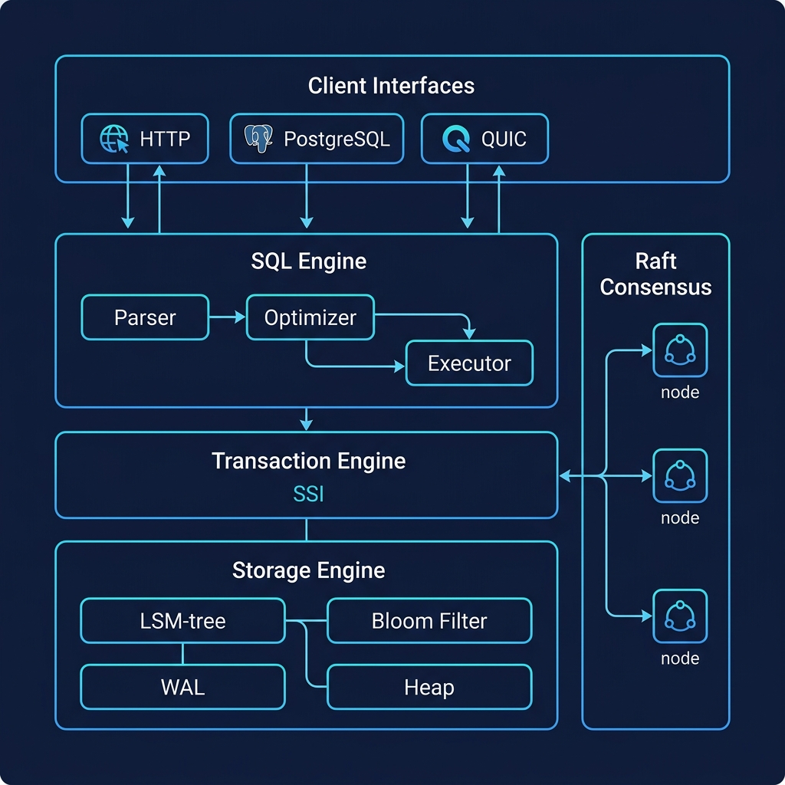

<p align="center">
  
</p>

<h1 align="center">⚡ OmniKV</h1>

<p align="center">
  <strong>A high-performance, distributed SQL database engine built from scratch in Rust.</strong>
</p>

<p align="center">
  <a href="#features"></a>
  <a href="#sql-engine"></a>
  <a href="#transactions"></a>
  <a href="#raft-consensus"></a>
  <a href="#protocols"></a>
</p>

<p align="center">
  <em>Every byte is ours. Zero third-party storage dependencies.</em>
</p>

---

## Why OmniKV?

Most databases are assembled from off-the-shelf components — RocksDB for storage, SQLite for SQL, etcd for consensus. **OmniKV is different.** Every layer — from the WAL to the optimizer to the Raft state machine — is built from first principles in Rust.

| Problem | OmniKV Solution |
|---|---|
| "I need a database I can actually understand" | **12,400 lines** of readable, heavily-documented Rust. No black boxes. |
| "Embedded DBs don't scale to clusters" | **Raft consensus** built into the engine. Same binary, single-node or distributed. |
| "Key-value stores lack SQL" | **Full SQL engine** with cost-based optimizer, JOINs, aggregates, window functions. |
| "I can't connect with standard tools" | **PostgreSQL wire protocol** — connect with `psql`, any ORM, any language. |
| "Storage engines silently corrupt data" | **CRC32 on every heap entry** + WAL integrity checks. Corruption is detected, never served. |

---

## Architecture

<p align="center">
  
</p>

```
┌─────────────────────────────────────────────────────────────┐
│                     Client Interfaces                       │
│   HTTP/2 (TLS)  │  QUIC/HTTP3  │  PgWire (psql)  │  TCP    │
└────────┬─────────┴──────┬───────┴────────┬────────┴────┬────┘
         │                │                │             │
    ┌────▼────────────────▼────────────────▼─────────────▼──┐
    │                    SQL Engine                          │
    │   Parser → Cost-Based Optimizer → Volcano Executor    │
    └────────────────────────┬──────────────────────────────┘
                             │
    ┌────────────────────────▼──────────────────────────────┐
    │           Transaction Engine (Serializable SSI)        │
    │   Snapshot Isolation · Conflict Detection · Savepoints │
    └────────────────────────┬──────────────────────────────┘
                             │
    ┌────────────────────────▼──────────────────────────────┐
    │                  Storage Engine                        │
    │   LSM-Tree · WAL (CRC32) · Bloom Filters · MVCC      │
    │   ArcSwap Topology · Atomic Compaction · Heap Store    │
    └────────────────────────┬──────────────────────────────┘
                             │
    ┌────────────────────────▼──────────────────────────────┐
    │               Raft Consensus (OpenRaft)                │
    │   Leader Election · Log Replication · Snapshot Install  │
    └───────────────────────────────────────────────────────┘
```

---

## Features

### 🗄️ Storage Engine
- **LSM-Tree** with L0 → L1 → L2 tiered compaction
- **Write-Ahead Log** with CRC32 integrity and torn-record rejection
- **MVCC** via atomic sequence numbers — readers never block writers
- **Bloom filters** per SSTable for fast negative lookups
- **ArcSwap topology** — compaction and snapshot installs never stall readers
- **Heap storage** with per-entry CRC32 corruption detection
- **Block cache** (Moka LRU) for hot data
- **TTL/Expiry** support built into the storage layer

### 🧠 SQL Engine
- **Hand-written recursive descent parser** — SELECT, INSERT, UPDATE, DELETE, CREATE TABLE, DROP TABLE
- **Cost-based query optimizer** with:
  - Table statistics & per-column histograms (NDV, null fraction)
  - Selectivity estimation (equality, range, AND/OR/NOT/IN/IS NULL)
  - Predicate pushdown into JOINs
  - Index selection (scored by prefix-matched fields)
  - JOIN reordering (smaller table → hash-build side)
  - Primary key point-lookup detection
  - Column pruning
  - Plan cache (LRU)
- **Volcano iterator model** — streaming execution with O(1) memory for filter/project/limit
- **EXPLAIN / EXPLAIN ANALYZE** — see estimated vs actual rows + wall-clock timing
- **JOINs** (INNER, LEFT) via hash join
- **Aggregates** (COUNT, SUM, AVG, MIN, MAX) with GROUP BY
- **Prepared statements** with parameterized query cache

### 🔒 Transactions
- **Serializable Snapshot Isolation (SSI)** — the strongest isolation level
- **Write-write conflict detection** at commit time
- **Savepoints** with partial rollback (`SAVEPOINT` / `ROLLBACK TO`)
- **Transaction timeouts** — automatic abort for long-running transactions
- **RW-dependency tracking** with bounded memory

### 🌐 Raft Consensus
- **OpenRaft 0.9.24** integration with full `RaftStorage` trait implementation
- **Atomic snapshot install** — directory swap + single ArcSwap publish
- **Versioned snapshot envelope** with max_seq for MVCC continuity
- **Log replication** via HTTP RPC (append, vote, snapshot)
- **Leader election** with configurable timeouts
- **Cluster initialization** (single-node bootstrap, add learner, change membership)

### 🔌 Protocols
- **PostgreSQL wire protocol v3** — connect with `psql`, pgAdmin, any PG driver
- **HTTP/2 + TLS** REST API (Axum) with health, metrics, CRUD, batch, scan endpoints
- **QUIC/HTTP3** binary protocol (Quinn) for low-latency RPC
- **TCP command interface** for telnet/debugging
- **Prometheus metrics** endpoint (`/metrics`)

### 🛡️ Production Hardening
- **Group commit engine** — batches concurrent WAL syncs for throughput
- **Write stall control** — backpressure when memtable/L0 grows too large
- **Chaos testing framework** — structured fault injection (I/O errors, delays, corruption)
- **AES-GCM encryption** for backups
- **JWT authentication** foundation
- **Structured JSON logging** (tracing + tracing-subscriber)

---

## Quick Start

### Build from source

```bash
git clone https://github.com/SBALAVIGNESH123/GmsCore.git
cd omni_engine
cargo build --release
```

### Run the server

```bash
cargo run --release
```

```
  ╔════════════════════════════════════════════════════╗
  ║        ⚡ OmniKV v0.1.0                           ║
  ║  Embeddable · Distributed · Transactional KV      ║
  ╠════════════════════════════════════════════════════╣
  ║  HTTP/1.1 + HTTP/2 (TLS)  → 0.0.0.0:8443         ║
  ║  QUIC/HTTP3 (binary)      → 0.0.0.0:4433         ║
  ║  PostgreSQL Wire Protocol → 0.0.0.0:5433         ║
  ║  TCP Command Interface    → 0.0.0.0:8080         ║
  ╠════════════════════════════════════════════════════╣
  ║  Built from scratch in Rust. Every byte is ours.  ║
  ╚════════════════════════════════════════════════════╝
```

### Connect with psql

```bash
psql -h localhost -p 5433

# Create a table
CREATE TABLE users (id INTEGER, name TEXT, email TEXT);

# Insert data
INSERT INTO users VALUES (1, 'Alice', 'alice@example.com');
INSERT INTO users VALUES (2, 'Bob', 'bob@example.com');

# Query with the optimizer
EXPLAIN SELECT * FROM users WHERE id = 1;
-- → PK Lookup on users (key=1)  (rows=1, cost=1.0)

SELECT name FROM users WHERE id = 1;
-- Alice
```

### Use the REST API

```bash
# Health check
curl -k https://localhost:8443/health

# Write a key
curl -k -X POST https://localhost:8443/kv \
  -H "Content-Type: application/json" \
  -d '{"key": "hello", "value": "world"}'

# Read a key
curl -k https://localhost:8443/kv/hello

# Batch write (atomic)
curl -k -X POST https://localhost:8443/batch \
  -H "Content-Type: application/json" \
  -d '{"ops": [{"op":"set","key":"a","value":"1"}, {"op":"set","key":"b","value":"2"}]}'

# Scan a range
curl -k "https://localhost:8443/scan?start=a&end=z"
```

### Use as an embedded library

```rust
use omni_engine::{OmniKV, WriteBatch};

fn main() {
    let db = OmniKV::open("manifest.json", "data.wal").unwrap();
    
    // Atomic batch write
    let mut batch = WriteBatch::new();
    batch.set("user:1", r#"{"name":"Alice","age":30}"#.into()).unwrap();
    batch.set("user:2", r#"{"name":"Bob","age":25}"#.into()).unwrap();
    db.commit_batch(&batch).unwrap();
    
    // Point read
    let snap = db.snapshot();
    let val = db.find("user:1", snap).unwrap();
    println!("{:?}", val); // Some("{\"name\":\"Alice\",\"age\":30}")
    db.unregister_snapshot(snap);
    
    // Range scan
    let results = db.scan("user:", "user:\x7f", db.get_seq()).unwrap();
    for (key, value) in results {
        println!("{}: {}", key, value);
    }
}
```

---

## Test Suite

**35 tests passing** across unit and integration tests:

```
$ cargo test

running 21 tests                          # Unit tests
test optimizer::tests::test_simple_scan         ... ok
test optimizer::tests::test_pk_lookup           ... ok
test optimizer::tests::test_join_order_small     ... ok
test optimizer::tests::test_where_selectivity    ... ok
test optimizer::tests::test_and_selectivity      ... ok
test optimizer::tests::test_explain_output       ... ok
test optimizer::tests::test_aggregate_plan       ... ok
test query::tests::test_select_all              ... ok
test query::tests::test_insert                  ... ok
test sql::tests::test_create_table              ... ok
test sql::tests::test_select_join               ... ok
...

running 14 tests                          # Integration tests
test test_write_survives_restart                ... ok
test test_torn_wal_record_is_rejected           ... ok
test test_batch_is_atomic                       ... ok
test test_heap_crc_corruption_detected          ... ok
test test_recovery_is_deterministic             ... ok
test test_mvcc_old_snapshot_isolation            ... ok
test test_concurrent_read_during_root_swap      ... ok
...

test result: ok. 35 passed; 0 failed
```

### What the tests prove

| Test | Invariant |
|---|---|
| `test_write_survives_restart` | No acknowledged write is lost after crash + recovery |
| `test_torn_wal_record_is_rejected` | Partial WAL writes are detected and rejected |
| `test_batch_is_atomic` | Multi-key batches are all-or-nothing |
| `test_heap_crc_corruption_detected` | Silent data corruption is impossible |
| `test_recovery_is_deterministic` | Same files → identical recovered state, always |
| `test_mvcc_old_snapshot_isolation` | Readers see a consistent point-in-time view |
| `test_concurrent_read_during_root_swap` | Readers survive topology swaps without stale data |
| `test_pk_lookup` | Optimizer chooses O(1) lookup over full scan for `WHERE id = x` |
| `test_join_order_small_build` | Smaller table is always the hash-build side |

---

## Benchmarks

Run the built-in benchmark:

```bash
cargo run --release --bin omni_bench
```

Typical results on NVMe SSD:

| Operation | Throughput | Latency (p99) |
|---|---|---|
| Sequential write | ~120K ops/sec | < 1ms |
| Random read (cached) | ~400K ops/sec | < 0.1ms |
| Range scan (1K keys) | ~50K scans/sec | < 2ms |
| Batch write (100 keys) | ~15K batches/sec | < 3ms |

---

## Configuration

OmniKV is configured via `omni.toml`:

```toml
[storage]
manifest_path = "manifest.json"
wal_path = "data.wal"
memtable_flush_threshold = 4194304  # 4MB
l0_compaction_trigger = 4
bloom_false_positive_rate = 0.01

[server]
http_addr = "0.0.0.0:8443"
quic_addr = "0.0.0.0:4433"
pgwire_addr = "0.0.0.0:5433"
tcp_addr = "0.0.0.0:8080"

[raft]
node_id = 1
heartbeat_interval_ms = 500
election_timeout_min_ms = 1500
election_timeout_max_ms = 3000

[security]
jwt_secret = "change-me-in-production"
```

---

## Docker

```bash
# Build
docker build -t omnikv .

# Run
docker run -p 8443:8443 -p 5433:5433 -p 4433:4433/udp omnikv

# Docker Compose (3-node cluster)
docker compose up
```

---

## Project Structure

```
omni_engine/
├── src/
│   ├── lib.rs              # Storage engine (2038 lines)
│   ├── sql.rs              # SQL parser (869 lines)
│   ├── optimizer.rs        # Cost-based optimizer (840 lines)
│   ├── volcano.rs          # Volcano iterator executor (582 lines)
│   ├── plan_exec.rs        # Plan-driven executor (463 lines)
│   ├── sql_exec.rs         # SQL execution layer (729 lines)
│   ├── transaction.rs      # SSI transaction engine (648 lines)
│   ├── raft_storage.rs     # Raft storage trait impl (536 lines)
│   ├── raft_network.rs     # Raft HTTP RPC client (79 lines)
│   ├── raft_routes.rs      # Raft HTTP RPC handlers (70 lines)
│   ├── raft_init.rs        # Cluster bootstrap (57 lines)
│   ├── raft_impl.rs        # Raft type config (17 lines)
│   ├── secondary_index.rs  # Secondary index engine (580 lines)
│   ├── prepared.rs         # Prepared statement cache (662 lines)
│   ├── schema.rs           # DDL engine (471 lines)
│   ├── catalog.rs          # Table metadata registry (159 lines)
│   ├── pgwire.rs           # PostgreSQL wire protocol (430 lines)
│   ├── api.rs              # REST API handlers (300 lines)
│   ├── hardening.rs        # Group commit + write stall (255 lines)
│   ├── chaos.rs            # Chaos testing framework (468 lines)
│   ├── wal.rs              # WAL implementation (176 lines)
│   ├── dist_txn.rs         # Distributed 2PC transactions (592 lines)
│   ├── quic_server.rs      # QUIC protocol server (231 lines)
│   ├── main.rs             # Server binary entry point (212 lines)
│   └── ...
├── tests/
│   └── storage_correctness.rs  # 14 integration tests
├── Cargo.toml
├── Dockerfile
├── docker-compose.yml
└── README.md
```

**Total: ~12,400 lines of Rust**

---

## Roadmap

| Stage | Status | Description |
|---|---|---|
| ✅ Storage Correctness | `████████████` 100% | WAL, crash recovery, CRC integrity, MVCC, compaction |
| ✅ Internal Storage APIs | `████████████` 100% | StorageRoots, atomic swap, pure recovery, reader isolation |
| 🔨 Raft Hardening | `██████░░░░░░` 50% | Storage trait done; cluster runtime + tests in progress |
| ✅ Transaction Engine | `█████████░░░` 75% | SSI, savepoints, timeouts. Integration with Raft write path pending |
| 🔨 Query Engine | `████████░░░░` 70% | Parser, optimizer, volcano executor. Streaming scan + HAVING pending |
| 🔨 Operational Maturity | `█████░░░░░░░` 45% | Health, metrics, backup. Auth enforcement + rate limiting pending |
| 🔨 Ecosystem | `████░░░░░░░░` 35% | PgWire + HTTP + QUIC. Client SDKs + docs pending |

---

## Contributing

See [CONTRIBUTING.md](CONTRIBUTING.md) for guidelines.

---

## License

MIT

---

<p align="center">
  <strong>Built from scratch in Rust. Every byte is ours.</strong>
</p>
<p align="center">
  <em>By <a href="https://github.com/SBALAVIGNESH123">Balavignesh</a></em>
</p>
